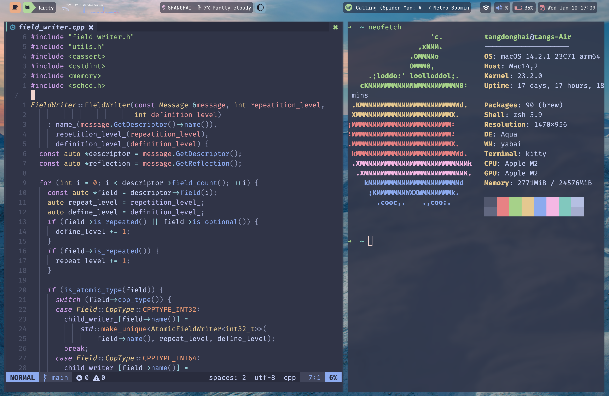

# Dotfiles

Personal dotfiles for macOS and Arch Linux (Hyprland).

## Arch Linux (Hyprland)


### Features

- **Window Manager**: Hyprland with smooth animations
- **Bar**: Waybar with Catppuccin theme
- **Terminal**: Kitty / Alacritty
- **Launcher**: Rofi
- **Notifications**: Dunst
- **Editor**: Neovim with Lazy.nvim
- **Shell**: Zsh with Oh-My-Zsh

### Installation

```bash
cd arch
chmod +x install.sh
./install.sh
```

### Key Bindings

#### Window Management

| Key | Action |
|-----|--------|
| `Super + Return` | Open Kitty Terminal |
| `Super + Q` | Close window |
| `Super + F` | Toggle floating |
| `Super + Space` | Open Rofi launcher |
| `Alt + Return` | Toggle fullscreen |
| `Super + L` | Lock screen |

#### Workspaces

| Key | Action |
|-----|--------|
| `Super + 1-5` | Switch to workspace 1-5 |
| `Super + Shift + 1-5` | Move window to workspace 1-5 |

#### Media & Brightness

| Key | Action |
|-----|--------|
| `F2/F3` | Brightness down/up |
| `F5` | Toggle mute |
| `F6/F7` | Volume down/up |
| `F8/F9/F10` | Previous/Play-Pause/Next |

#### Screenshots

| Key | Action |
|-----|--------|
| `Super + P` | Screenshot selection |
| `Print` | Screenshot full screen |

### Post-Installation

1. **Configure monitors**: Edit `~/.config/hypr/hyprland.conf`
2. **Set wallpaper**: Add images to `~/.config/swww/`
3. **Git config**: Edit `~/.gitconfig` with your name/email
4. **Secrets**: Add API keys etc to `~/.zshrc.local`
5. **Tmux plugins**: Press `Ctrl+B` then `I` in tmux

### Dependencies

```bash
# Core
yay -S hyprland waybar rofi dunst kitty alacritty swww

# Utilities
yay -S hypridle hyprlock brightnessctl pamixer playerctl grim slurp swappy

# Development
yay -S neovim tmux fzf thefuck atuin pyenv jenv

# Fonts
yay -S ttf-maple ttf-jetbrains-mono-nerd ttf-sf-pro
```

---

## macOS



### Key Bindings

#### Window Management (yabai + skhd)

| Key | Action |
|-----|--------|
| `Cmd + Return` | Open Kitty Terminal |
| `Alt + h/j/k/l` | Focus window left/down/up/right |
| `Alt + q` | Close current window |
| `Shift + Alt + h/j/k/l` | Resize window |
| `Ctrl + Alt + h/j/k/l` | Swap window |
| `Shift + Cmd + h/j/k/l` | Move window |
| `Alt + f` | Toggle native fullscreen |
| `Shift + Alt + f` | Toggle zoom fullscreen |
| `Shift + Alt + Space` | Float/unfloat window |

#### Kitty

| Key | Action |
|-----|--------|
| `Cmd + u/d` | Scroll terminal up/down |
| `Cmd + t` | New tab |
| `Cmd + 1-9` | Go to tab |

#### Tmux

| Key | Action |
|-----|--------|
| `Ctrl+B + \|` | Split pane vertically |
| `Ctrl+B + -` | Split pane horizontally |
| `Ctrl+B + c` | New tab |
| `Cmd + Arrow` | Navigate panes |

---

## Structure

```
dotfile/
├── arch/
│   ├── .zshrc
│   ├── .bashrc
│   ├── .gitconfig
│   ├── .tmux.conf
│   ├── install.sh
│   └── .config/
│       ├── nvim/
│       ├── hypr/
│       ├── kitty/
│       ├── alacritty/
│       ├── waybar/
│       ├── rofi/
│       └── dunst/
└── macos/
    ├── .zshrc
    ├── .skhdrc
    ├── .tmux.conf
    └── .config/
        ├── nvim/
        └── kitty/
```
